# Lung Cancer Survival Analysis

## Table of Contents
* [Project Objective](#project-objective)
* [Methods](#methods)
* [Technologies](#technologies)
* [Getting Started](#getting-started)
* [Project Description](#project-description)
* [Models Results](#models-results)
    * [Kaplan-Meier Estimator](#kaplan-meier-estimator)
    * [Nelson-Aalen](#nelson-aalen)
    * [Log-Rank Test](#log-rank-test)
    * [Cox Regression](#cox-proportional-hazards-regression)
* [License](#license)

## Project Objective
The objective of the project is to estimate the time-to-death for patients diagnosed with lung cancer.

## Methods
* Data Visualization
* Survival Analysis
    * Kaplan-Meier Estimator
    * Nelson-Aalen Estimator
    * Log-Rank Test
    * Cox's Proportional Hazard Model

## Technologies
* Jupyter Notebook
* Python 3.8.1
* Python Packages
    * pandas
    * numpy
    * lifelines KaplanMeierFitter
    * lifelines NelsonAalenFitter
    * lifelines logrank_test
    * lifelines CoxPHFitter
* Python Virtual Environment

## Getting Started
1. If necessary, install the python3-venv package using the following command:
    sudo apt install python3.8-venv
2. Create a virtual environment with:
    python3 -m venv survival-wkspc
3. cd into the survival-wkspace folder
4. Activate the environment:
    source bin/activate
5. Install python packages:
    python3 -m pip -r requirements.txt

## Project Description
### In oncology, typical questions to be answered are:
* What is the impact of specific clinical characteristics on patients' survival?
    * EG: Is there a difference between people who have high blood sugar and those who do not?
* What is the probability that an individual survives a specific time?
    * EG: Given a set of cancer patients, what is the probability that a patient will be alive at that time if some set of time has passed?
* What, if any, are the differences in survival between groups of patients?
    * EG: Compare the effects of two different treatments.

### Survival Analysis Fundamentals:
* Survival Time - The amount of time until an event
    * Events could be birth, death, product failure, etc...
* Relapse - A deterioration in the subject's state of health after a temporary improvement
* Progression - The process of developing or moving gradually towards a more advanced state
* Data Censoring - Occurs when observations do not experience the event of interest
    * EG: In the study of a product's failure, some products might not fail
    * Right Censoring - Occurs when the subject under observation does not or has not yet experienced the event
        * EG: When studying death, a patient might still be alive
    * Left Censoring - Occurs when the event cannot be observed
        * EG: The event could have occurred before the study began
    * Interval Censoring - Occurs when the data is for a specific time interval
        * EG: The event of interest might occur before or after, but not during the study

### Two related probabilities are used to analyze survival data:
1. Survival Function (S)
    * Defined as the probability that a subject survives from the diagnosis of a disease to a specified future time, t
    * Focuses on the survival of a subject
    * EG: S(200) = 0.7 means that after 200 days, a subject's probability of survival is 0.7
    * Kaplan-Meier Estimator is used to find the survival probability of a subject
2. Hazard Function (H)
    * Defined as the a subject under observation at time t has an event at time t
    * Focuses on the death of a subject
    * EG: H(200) = 0.7 means that on or after 200 days, the probability of death is 0.7
    * NOTE: The Hazard Function gives us the cumulative probability

## Models Results
### Kaplan-Meier Estimator
* Is a non-parametric statistic used to estimate the survival function from the lifetime data
* Often used to measure the fraction of patients living for a specific time after treatment or diagnosis
* These plots help to visualize survival curves

#### The probability of survival at time ti, S(ti), is calculated as follows:

#### More simply:

# TODO: Talky stuff here

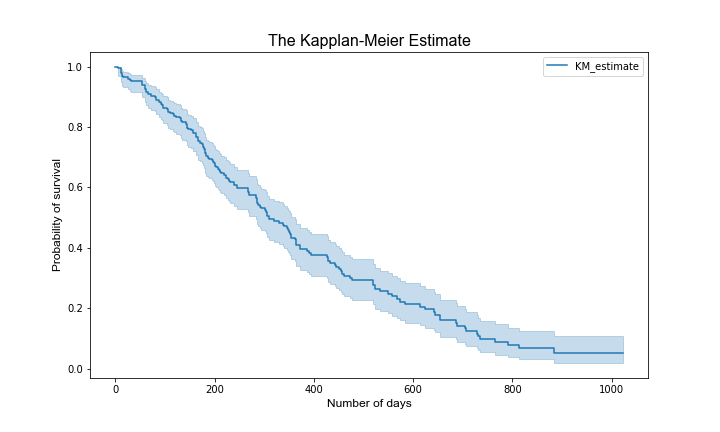

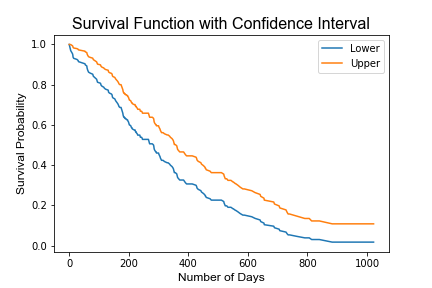

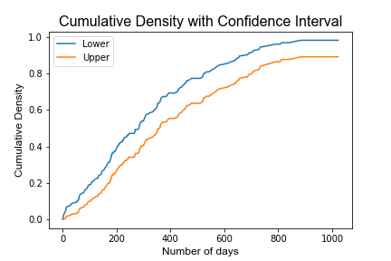

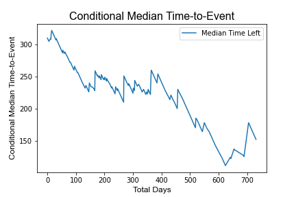

### Nelson-Aalen Estimator
* Is a non-parametric statistic used to estimate hazard rates
* Often used to measure the fraction of patients who have died for at or by a specified time after treatment or diagnosis
* Aggregate information regarding survival can be visualized using the Nelson-Aalen hazard function, h(t). The hazard function gives us the probability that a subject under observation at time t has an event of interest at that time
* NOTE: The hazard rate CANNOT be found by transforming the survival rate

#### The cumulative probability of hazard at time t, H(t), is calculated as follows:

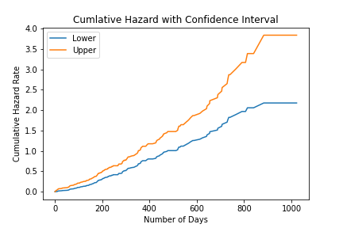

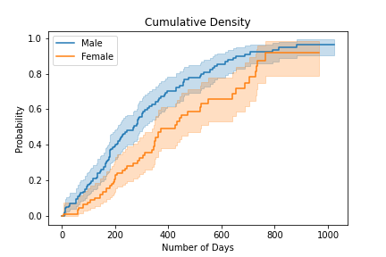

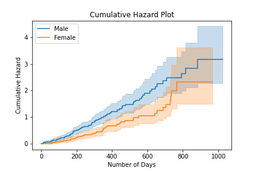

#### To calculate non-cumulative hazard probability at a specified time, t:

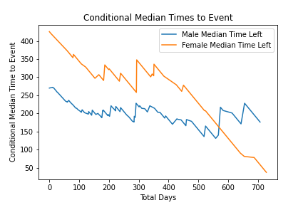

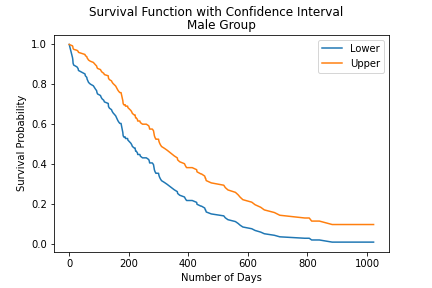

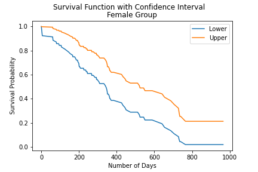

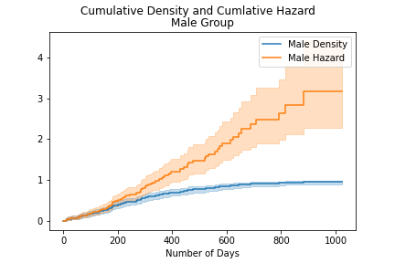

### Log-Rank Test
* Is a hypothesis test that is used to compare the survival distributions of two samples with the goal of determining if there is any significant difference between the groups compared.
* The null hypothesis states that there is no significant difference between groups being studied.

### Cox's Proportional Hazard Regression
* Is a regression model used, generally, by medical researchers to determine the relationship between the survival time of a subject and one or more predictor variables. It helps us to determine how different parameters such as age, sex, weight, height, etc.. affect the survival time of a subject.
* Unlike the Kaplan-Meier Estimator, the Nelson-Aalen Estimator, and the Log-Rank Test, Cox's Proportional Hazard Regression Analysis works for both categorical and non-categorical predictors.
* In short, it is used to determine how different factors impact the event of interest.
* Hazard Ratio (HR)
    * HR = value of exp(bi) from the Hazard Function
    * HR = 1 : No Effects
    * HR < 1 : Reduction in Hazard
    * HR > 1 : Increase in Hazard

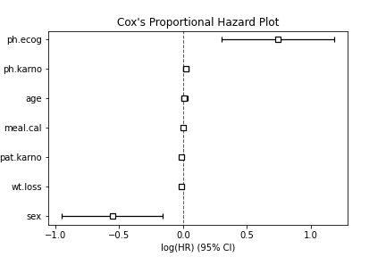

